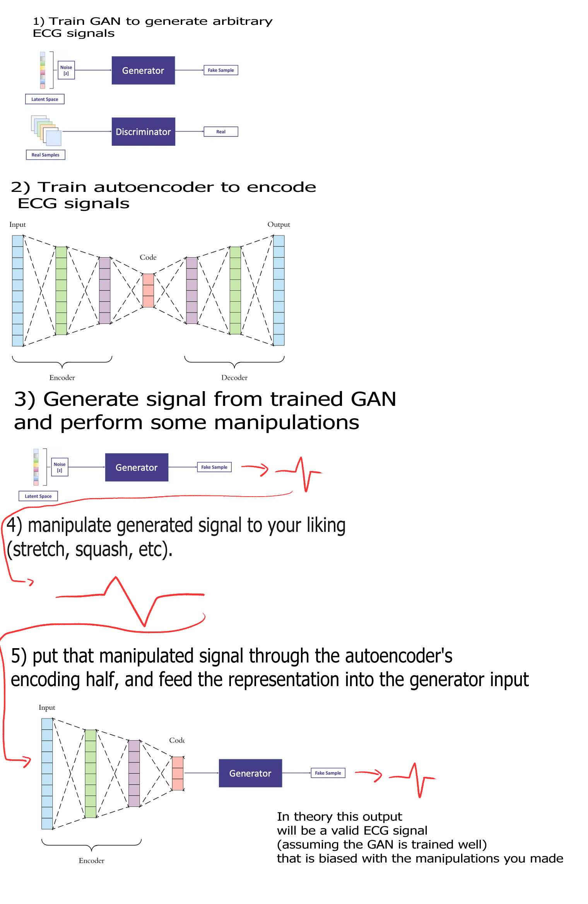
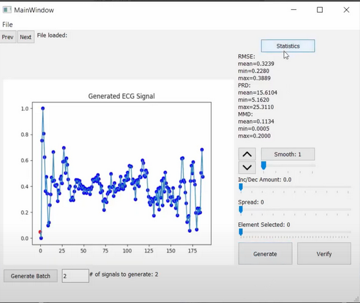
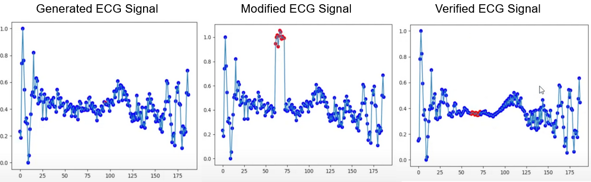

# SynthECG: Generating Controlled Synthetic ECG Signals
Medical data is often highly sensitive and difficult to obtain since
it involves collecting information from real people and patients.
Thus, it is desirable to have some method of obtaining vast
amounts of data without the risk of privacy invasion.
Specifically, for other machine learning applications, abnormal data is needed in order to train neural networks that may aid diagnoses, which are even more difficult to obtain given its lack of prevalence in real life. In this
area, generative models have come a long way. In this project,
we propose a user-interface and deep-learning pipeline for
generating large amounts of user-manipulated ECG data, allowing the user to specify modifications and generate realistic ECG signals that retain similar manipulations. The
target audience is medical professionals.

[Video Link](https://youtu.be/9GxjO4-EdEE)

# Machine Learning Pipeline Diagrams
Below is the diagram of the main experimental portion of this
project. We trained two models for this project.

An autoencoder [1] and GAN [3] are trained with the real ECG signal MIT-BIH Arrhythmia Dataset [5]. The SynthECG pipeline is composed of the encoder of the autoencoder and the generator of the GAN, where the input into the encoder is the modified ECG signal from the UI, and the final output from the generator is the verified ECG signal with similar modification in place. The encoder encodes the modification into a lower dimensional latent space. The generator, which usually takes random noise as input, takes the encoder output and re-constructs it into a valid ECG signal, taking into account the biases encoded.

# User Interface
The user interface was build in PyQT and contains several
features for manipulating and examining signals:

Features include:
* Load/export ECG signals
* Generate/generate batch/verify signals
* Signal previewer
  * View individual signals from batch
* Signal manipulation
   * Select nodes and width
   * Alter selected node values
   * Smoothing w/ Gaussian filter

Example plots in the manipulation and verification process.

# Results and Further Work
The variation of the signals that the generator portion of the GAN generated is not very good, but it isn't bad either. There is some variation where no two signals are identical but they do look somewhat similar. This could be an issue with the training data lacking diversity. In the training data that was used, the graphs looked fairly similar with a lot of peaks all in the same location, but the magnitude is just different. Other peaks are just shifted here and there and as a result, the biasing effects are minimal.

Unfortunately the cause of this is unknown to us, but we do have some theories as to why this is happening. One possible issue for the minimal biasing could be because of the nature of the autoencoder. When we train the model on a dataset, the latent distributions of the latent attributes are established and the autoencoder basically generates things by randomly choosing values in that established latent distribution for each respective latent attribute. When we modify the generated signal and try to feed those changes into the encoder portion of the autoencoder, the changes are simply not support because maybe we've modified a latent attribute far outside of its latent distribution. To remedy this, a significantly larger and more diverse data set to train on is needed, but again, it can still suffer from this if the modified signal is modified far beyond what the encoder supports. One positive side effect from this is if the user decided to modify an ECG signal that isn't humanly possible. Since there isn't any training data with that sort of variation or change, since it isn't possible, the encoder will just ignore the extreme changes or generate a similar one to the best of its ability.

Another possible issue is that maybe the changes being fed into the encoder are just being ignored completely. Perhaps there needs to be some sort of control into what we're generating by conditioning the encoder and decoder of the model. This is where the introduction of a conditional variational autoencoder or generative adversarial network might fix the problems presented here.

# CGAN/CVAE Speculative Issues
We've explored the idea of using CGANs or CVAEs in our project before in order to control what gets generated, but haven't really considered how to implement it into our project. After doing more research, the current state of the CVAE and CGAN might not be able to help use after all. Recall for these models that we can control what gets generated by specifying a conditional variable to be trained on. Most of the time, this is the class label. For example, using the MNIST database of handwritten numbers, there's a class label for each image that specifies what number the image represents. The models are trained using these images and corresponding class labels and if we want to generate a specific image, the condition we feed into the model is the class label, converted into a one-hot vector. This works well for 2D image type generation with non-binary class labels, but how about 1D signals with binary class labels? When we trained our model, we had values that represented a signal and then we assigned a corresponding class label of real or fake. As far as we know, if we decided to make this conditional, all we could do is specify that the signal generated be real or fake. These models might work in the future, or after much theorizing, modifying, and testing, but from our combined knowledge and experience, we just can't think of how to make them work for us. 

# References
Autoencoder Model:

[1] Ashutosh Chandra, Rahul Kala. Regularised Encoder-Decoder Architecture for Anomaly Detection in ECG Time Signals. 2019.

[2] https://github.com/ashukid/anomaly-detection-in-ecg-signal

GAN Model:

[3] Anne Marie Delaney, Eoin Brophy, Tomás E. Ward. Synthesis Of Realistic ECG Using Generative Adversarial Networks. 2019

[4] https://github.com/MikhailMurashov/ecgGAN

[5] G. Moody and R. Mark, “The impact of the MIT-BIH Arrhythmia Database,” IEEE Engineering in Medicine and Biology Magazine, vol. 20, no. 3, pp. 45–50, 2001. 